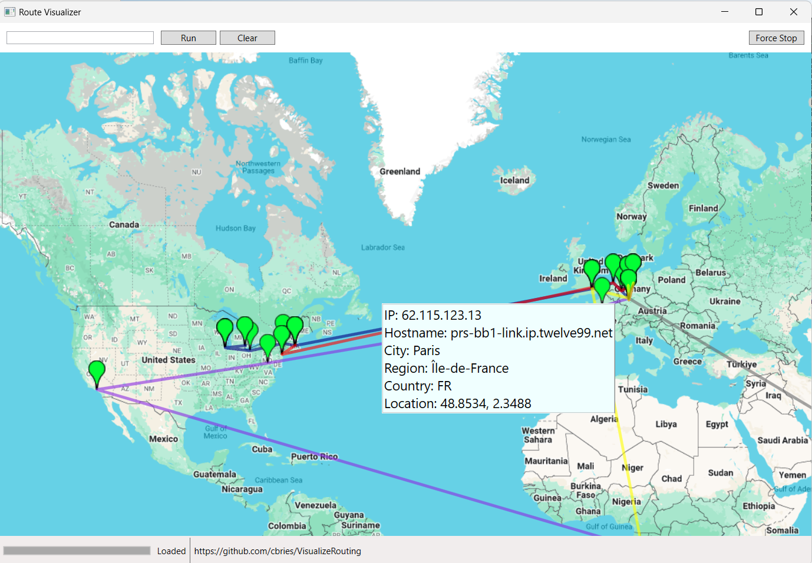

# VisualizeRouting

Visualizes a trace to a specific host and provides the node locations.

# Installation

- account for https://ipinfo.io is required
- store your access token into the file `ipinfo.token` side by side to the executable
